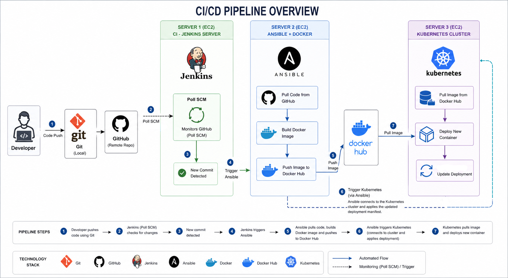
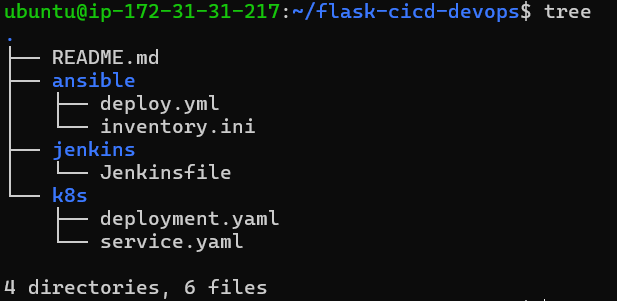

# End-to-End CI/CD Pipeline using Jenkins, Docker, Ansible and Kubernetes

## Overview

This project implements a complete CI/CD pipeline that automates the process of building, containerizing, and deploying a Python Flask application to a Kubernetes cluster.

The pipeline is designed using a multi-server architecture where each component performs a dedicated role in the CI/CD lifecycle.

---

## Application Repository

The application source code is maintained in a separate repository:

https://github.com/Shikhar-T/devops-python-app.git

---

## Architecture

The following diagram illustrates the complete workflow of the system:

---

## Workflow

1. Code is managed using Git and pushed to GitHub

2. Jenkins monitors the repository using Poll SCM

3. On detecting changes, Jenkins triggers the pipeline

4. Jenkins connects to the Ansible server via SSH

5. Ansible performs the following:

   * Clones the latest code from GitHub
   * Generates a commit-based tag
   * Builds a Docker image
   * Pushes the image to DockerHub

6. Jenkins connects to the Kubernetes server via SSH

7. Kubernetes deployment is updated using:

   kubectl set image deployment/myapp-deployment myapp=shikhardevops/myapp:<commit-id>

8. Kubernetes performs a rolling update and deploys the new version

---

## Tech Stack

* Git (Version Control)
* GitHub (Repository Hosting)
* Jenkins (CI Pipeline)
* Docker (Containerization)
* Ansible (Automation)
* Kubernetes - Minikube (Orchestration)
* AWS EC2 (Infrastructure)

---

## Project Structure

---

## Initial Deployment

kubectl apply -f k8s/deployment.yaml
kubectl apply -f k8s/service.yaml

---

## Accessing the Application

The application is exposed using Kubernetes port forwarding:

kubectl port-forward service/myapp-service 5000:5000 --address 0.0.0.0

After running this command, the application can be accessed using:

http://<k8s-EC2-PUBLIC-IP>:5000

Ensure that the Security Group attached to the EC2 instance allows inbound traffic on port 5000.

---

## Key Implementation Details

* Docker images are tagged using Git commit IDs for version tracking
* Jenkins uses SSH-based execution to trigger Ansible and Kubernetes
* Kubernetes deployment is updated dynamically using `kubectl set image`
* Rolling updates ensure minimal downtime during deployments
* CI and CD responsibilities are separated across Jenkins, Ansible, and Kubernetes

---

## Security Considerations

* DockerHub credentials should be managed securely (e.g., Jenkins Credentials or Ansible Vault)
* SSH key-based authentication is used between servers
* Sensitive data is not stored directly in the repository

---

## Author

Shikhar Tiwari
